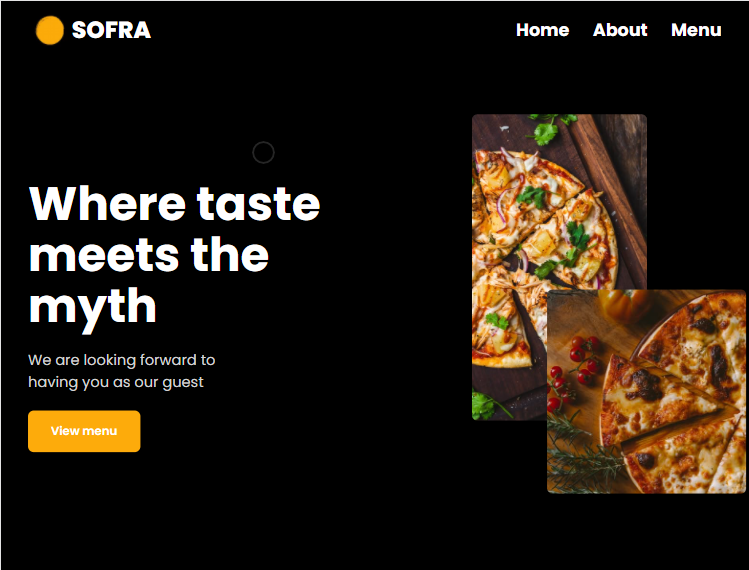
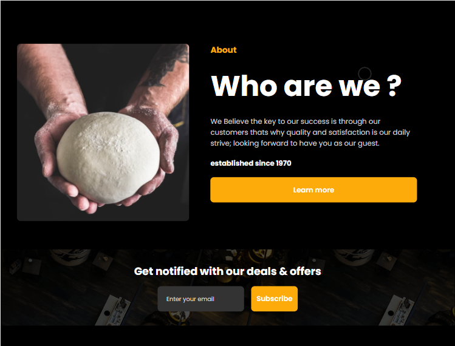
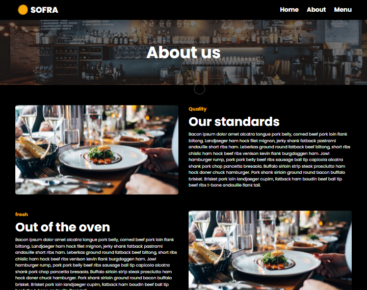
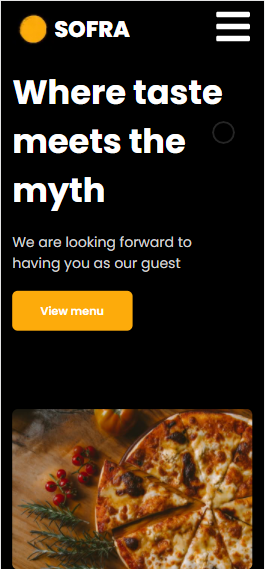
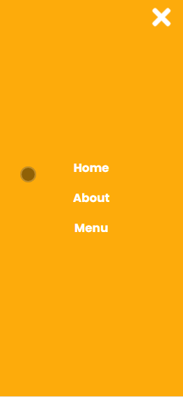

# Sofra 🍽

This is a react js template built for restaurants with next.js
[Live Preview](https://optimistic-ramanujan-ced7b3.netlify.app/)

## Features
* clean design
* reusable custom components library
* customizable & reusable sections
* optmized for mobile phones
* clean & responsive navbar
* adobe xd design files included

You can check the adobe xd design file in the "stock" folder

## to run locally

fork the project then:

### `npm install`
### `npm run dev`

## screenshots

